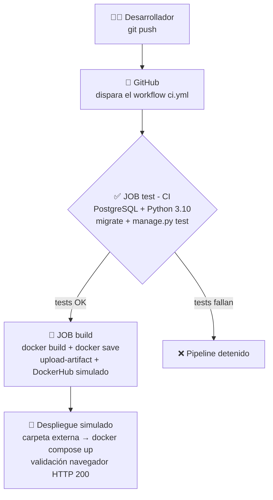

# Flujo CI/CD para Django

**Integración y Despliegue Continuo con GitHub Actions y Docker**

- **Proyecto:** Sistema de Gestión de Tareas (Django + PostgreSQL)
- **Repositorio:** https://github.com/Eneritzch/P3_GCS
- **Fecha:** 18 de junio de 2026

> 📄 Versión imprimible en **[Flujo_CICD_Django.pdf](Flujo_CICD_Django.pdf)**

---

## 1. Introducción y objetivo

Pipeline de **CI/CD** para una aplicación **Django** con **PostgreSQL**. Automatiza:

- **CI (Integración Continua):** ejecutar las pruebas en cada push.
- **Build:** empaquetar la app en una imagen Docker reproducible.
- **CD (Despliegue Continuo, simulado):** entregar la imagen y levantarla con Docker Compose.

---

## 2. Diagrama del flujo CI/CD



Diagrama lineal equivalente:

```
Desarrollador ─push─▶ GitHub ─▶ [JOB test: BD + Python + tests]
        │ (solo si pasan, needs: test)
        ▼
   [JOB build: docker build → save → artefacto → DockerHub simulado]
        ▼
   [Despliegue simulado: clone/load → docker compose up → navegador (HTTP 200)]
```

---

## 3. Explicación del `ci.yml`

### 3.1. Disparadores

```yaml
on:
  push:
    branches: ["main", "ci-setup"]
  pull_request:
    branches: ["main"]
  workflow_dispatch:   # ejecución manual
```

### 3.2. Job 1 — `test` (CI)

| Elemento | Función |
|----------|---------|
| `services: postgres` | Contenedor PostgreSQL 15 con healthcheck (BD real para los tests) |
| `env` | Variables que lee `settings.py` (credenciales/host de BD) |
| `actions/checkout` | Clona el repo en el runner |
| `setup-python 3.10` | Instala Python 3.10 con caché de pip |
| `pip install -r requirements.txt` | Instala dependencias |
| `manage.py check / migrate` | Valida el proyecto y aplica migraciones |
| `manage.py test` | **Ejecuta las 11 pruebas.** Si fallan, el pipeline se detiene |

### 3.3. Job 2 — `build` (construcción + entrega)

| Elemento | Función |
|----------|---------|
| `needs: test` | Solo corre si los tests pasaron (nunca empaqueta código roto) |
| `setup-buildx` | Prepara el motor de build de Docker |
| `docker build` | Construye la imagen con etiquetas `latest` y `SHA` (trazabilidad) |
| `docker save` | Empaqueta la imagen en `gcs-web-image.tar` |
| `upload-artifact` | Sube el `.tar` como artefacto descargable |
| Push DockerHub *(simulado)* | Imprime los comandos del despliegue real; el bloque real queda comentado y se activa con los secrets `DOCKERHUB_USER` y `DOCKERHUB_TOKEN` |

---

## 4. Contenedorización con Docker

- **Dockerfile:** base `python:3.10-slim`, dependencias en capa separada (caché), `ENTRYPOINT` que prepara el entorno y arranca **Gunicorn**.
- **entrypoint.sh:** espera a PostgreSQL (`pg_isready`) → `migrate` → `collectstatic` → ejecuta el comando.
- **docker-compose.yml:** servicio `db` (PostgreSQL 15 + volumen) y `web` (Django/Gunicorn, depende de `db` healthy, puerto `8000:8000`).

> **Mapeo de puertos:** `"8000:8000"` conecta el puerto 8000 del equipo con el del contenedor; por eso `http://localhost:8000` muestra la app dentro de Docker.

---

## 5. Despliegue simulado

```bash
mkdir C:\despliegue_gcs && cd C:\despliegue_gcs
git clone https://github.com/Eneritzch/P3_GCS.git && cd P3_GCS
docker compose up -d --build
docker compose ps                 # contenedores Up
# Navegador → http://localhost:8000   (HTTP 200, CRUD funcional)
```

Pasos completos en **[deploy-notes.md](deploy-notes.md)**.

---

## 6. Recomendaciones finales

- **Secretos:** usar *GitHub Secrets* / variables de entorno, nunca en el código.
- **Producción:** `DJANGO_DEBUG=False` y `ALLOWED_HOSTS` con el dominio real.
- **DockerHub real:** activar el bloque comentado del job `build`.
- **Calidad:** añadir linters (flake8/black) y `coverage` al job `test`.
- **Estáticos:** servir con WhiteNoise o Nginx.
- **Despliegue real:** sustituir la simulación por SSH/VPS/cloud o un runner autoalojado.

---

## 7. Conclusiones

Cada cambio subido a GitHub se prueba automáticamente y, solo si pasa, se construye
y empaqueta la imagen Docker lista para desplegar. La contenedorización elimina el
"en mi máquina sí funciona".

---

## Anexo · Checklist de entregables

| Sesión | Entregable | Estado |
|--------|------------|--------|
| 1 | Proyecto Django + tests | ✔ |
| 1 | Rama `ci-setup` + `ci.yml` con tests | ✔ |
| 2 | `Dockerfile` y `docker-compose.yml` | ✔ |
| 3 | Build de imagen + artefacto | ✔ |
| 3 | Despliegue simulado + `deploy-notes.md` | ✔ |
| 4 | Documento técnico (PDF) + repo actualizado | ✔ |
